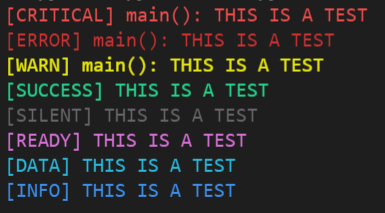
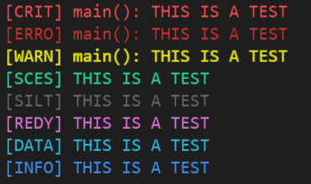
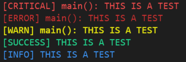
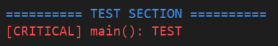

# Pyostra Package
Custom terminal colored logging system developed for the [Advanced NFTs Generator](https://github.com/ostra-project/Advanced-NFTs-Generator) and maintained for future projects.

[PyPI for releases](https://pypi.org/project/pyostra/) | [Github for source](https://github.com/yoratoni/pyostra)


## Installation
Developed for Python 3.9, normally supports CPython 2.7 => 3.10 | Pypy 2.7 and 3.6.

Only requirement other than the standard library is [Colorama](https://github.com/tartley/colorama), this package have the same Python / platform requirements.

```
pîp install pyostra
```


## Description
Pyostra is the main central library used for my own projects such as the [Advanced NFTs Generator](https://github.com/ostra-project/Advanced-NFTs-Generator). This library allows custom colored and formatted outputs in the Terminal.
The goal is to simplify all the interactions with the terminal by the developers such as try / except errors etc..

Note that this library will later include many other general functions, it is not specifically made for Terminal outputs only but to centralize all of the general functions that I'm using in my projects instead of copying the code everytime. I still decided to make it public so people can use it too if they want.


## LogTypes class
This class contains all the log types for the `pyprint()` function.

It contains all of these log types by default:
- CRITICAL
- ERROR
- WARN
- SUCCESS
- SILENT
- READY
- DATA
- INFO

A log type can also be created by using the `new_log_type()` function, it returns a dict with the right format.

The dict used for a log type is pretty simply:
```py
DATA = {
    # The default name used by the log messages
    'longName': 'DATA',
    
    # Check the set_short() function doc below to understand
    'shortName': 'DATA',
    
    # The color of the log type at the start
    'typeColor': Fore.LIGHTCYAN_EX,
    
    # The color of the log message
    'msgColor': Fore.LIGHTCYAN_EX,
    
    # Includes in forced types (print even when verbose debugging is turned off)
    'includeInForce': False
}
```

## Pyprint
Default format of a Pyprint log, using the default log types:
```py
from pyostra import LogTypes, pyprint

def main():
    pyprint(LogTypes.CRITICAL, 'THIS IS A TEST')
    pyprint(LogTypes.ERROR, 'THIS IS A TEST')
    pyprint(LogTypes.WARN, 'THIS IS A TEST')
    pyprint(LogTypes.SUCCESS, 'THIS IS A TEST')
    pyprint(LogTypes.SILENT, 'THIS IS A TEST')
    pyprint(LogTypes.READY, 'THIS IS A TEST')
    pyprint(LogTypes.DATA, 'THIS IS A TEST')
    pyprint(LogTypes.INFO, 'THIS IS A TEST')
    
main()
```
Notice that `CRITICAL`, `ERROR` and `WARN` log types also returns the calling function name,
it can be disabled by using the optional `disable_function_name` argument for every log where you don't want the calling function name to show.




### set_short() function
This function allows you to reduce the log type length to 4 chars, it can be used if you have a lot of logs at the same time, for better readability. It uses the `shortName` string key inside a log type dict.
```py
import pyostra

pyostra.set_short(True)
```
If not clear, all the correspondances with the full log types can be found inside the pyprint/set_short function docstring.




### set_verbose() function
This function allows to you to reduce the amount of logs inside the Terminal by ignoring some log types.
```py
from pyostra import LogTypes, pyprint, set_verbose

set_verbose(False)

def main():
    pyprint(LogTypes.CRITICAL, 'THIS IS A TEST')
    pyprint(LogTypes.ERROR, 'THIS IS A TEST')
    pyprint(LogTypes.WARN, 'THIS IS A TEST')
    pyprint(LogTypes.SUCCESS, 'THIS IS A TEST')
    pyprint(LogTypes.SILENT, 'THIS IS A TEST')  # IGNORED
    pyprint(LogTypes.READY, 'THIS IS A TEST')  # IGNORED
    pyprint(LogTypes.DATA, 'THIS IS A TEST')  # IGNORED
    
    # IGNORED BY DEFAULT BUT FORCED WITH THE force_verbose ARG
    pyprint(LogTypes.INFO, 'THIS IS A TEST', force_verbose=True)
    
main()
```
By setting the verbose to False, only `CRITICAL`, `ERROR`, `WARN` and `SUCCESS` log types will be printed, the other ones are ignored.



In addition to that, the optional argument called `force_verbose` inside the `pyprint()` function allows to you print other log types even when the verbose debugging is turned off.


### new_section() function
This simple function allows you to separate different types of log by printing a title with a bunch of separators.

This function contains only optional args:
- section_title (str, optional): The title of the current section.
- skip_line (bool, optional): If True, skip a line before the title.
- section_title_color (str, optional): Use Colorama for that.
- separator_char (str, optional): The character used by the section title.
- separators_amount (int, optional): The amount of separators for the title.

```py
from pyostra import LogTypes, new_section, pyprint

def main():
    new_section('TEST SECTION', separators_amount=10)
    pyprint(LogTypes.CRITICAL, 'TEST')
```




